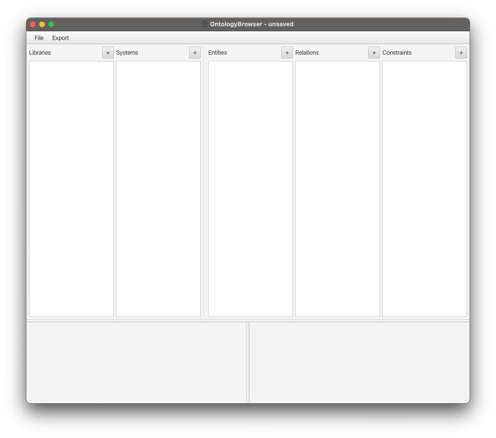
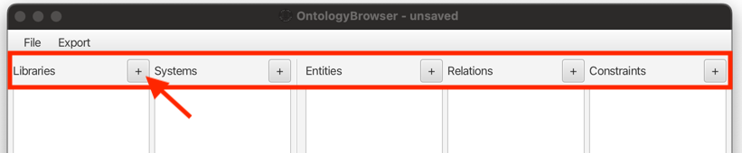
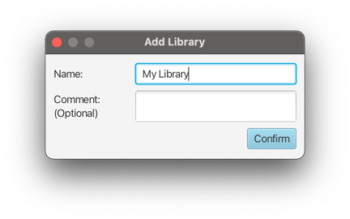
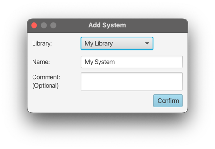
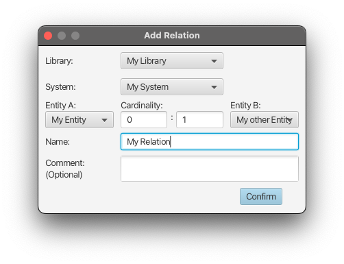
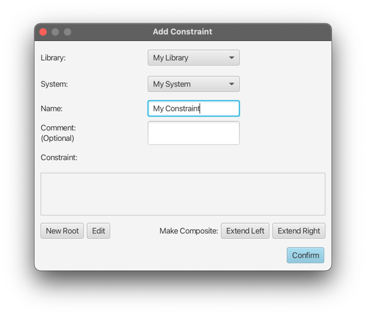
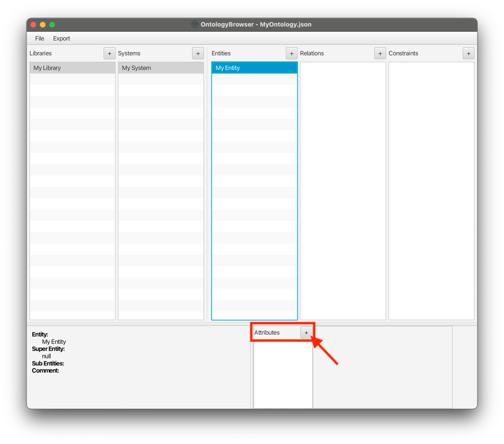

# Ontology Browser

This tool provides a graphical user interface that allows the creation of ontologies.

Further, it is able to generate an Input Model from an existing ontology,
that can then be used as input for the combinatorial-testing-tool [ACTS](TODO)

## Compile & Run

The tool is written in java using maven, and utilizing javafx as frontend-library.

To build an executable jar file, run

```bash
 ./mvnw clean compile package
```

The jar file supports two ways of execution:

### Running the full OntologyBrowser with graphical interface

Simply execute the jar without additional parameters by running

```bash
java -jar target/OntologyBrowser-1.5.jar`
```

### Generate Input Model without GUI

The jar can also be used to directly create an input model from the command line.

Therefore, following 4 parameters need to be passed:

1. Path to the ontology json file
2. Name of the library within the ontology
3. Name of the system within the library
4. Path to the output file

```bash
java -jar ontologybrowser.jar <input> <library> <system> <output>
```

## Usage

The general interface of the browser looks like the following:

When an object is selected, all further views will show the respective contained objects.

When for example a Library is selected, the Systems list will show all existing Systems in this Library.
The same applies to a selected System, where contained Entities, Relations and Constraints are shown.

The bottom left area shows details about the selected Object.

When an Entity or Relation is selected, the bottom right area will show the Attributes of the respective Objects,
and allow generation and modification of Attributes.

### Ontology Structure

- Libraries
  - Systems
    - Entities
      - Attributes
    - Relations
      - Attributes
    - Constraints

### Creation of Objects

Objects can be created using the `+` buttons in the respective column.

Depending on the type of object, a specific dialog window asking for properties will appear.

All types require a name, and allow for an optional comment.

Names must be unique in the context of the encapsulating objects.
Library-names must be unique globally, while system-names only need to differ inside the same library, etc.



#### Libraries

Libraries are the top-level and simplest objects in an ontology,
as they only the name as the single property.\


#### Systems

As each system is part of a library, the library to add the system to is required in addition to the name.


#### Entities

As there can be inheritance relationships between entities of the same system,
a super entity can be specified upon entity creation.


#### Relations

Relations can be created between two Entities of a System.
The left and right cardinality field represent the minimum and maximum arity, respectively.
(*"One Entity A can have at least min and at most max Entity B's"*)



#### Constraints

Custom constraints can be added to restrict values of Attributes of Entities of a System.
Currently, constraints are 



#### Attributes

Entities and Relations can have attributes. When one of such Objects is selected, the bottom right panel will
show the Attributes section. Here, attributes can be created by using the `+` button.



**TODO more details about different types**
