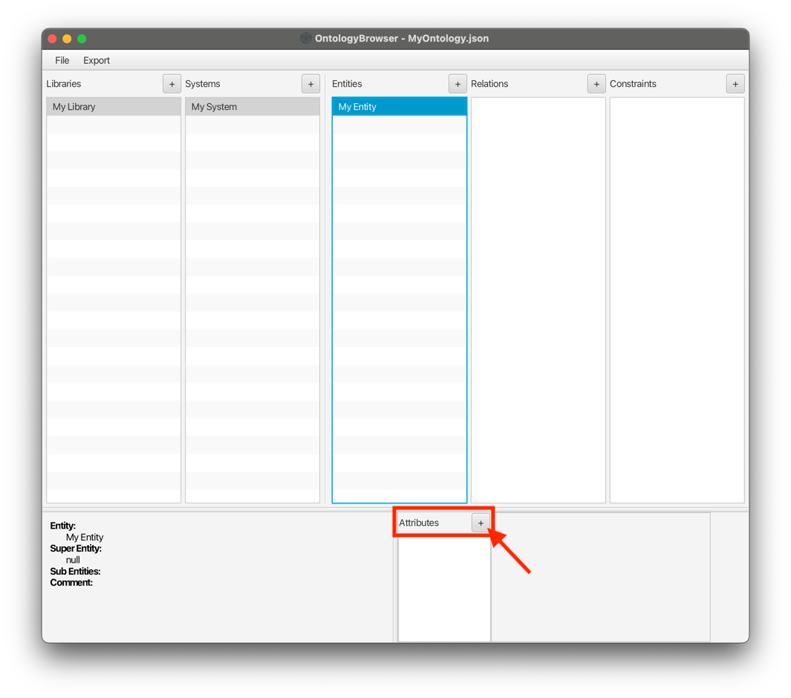
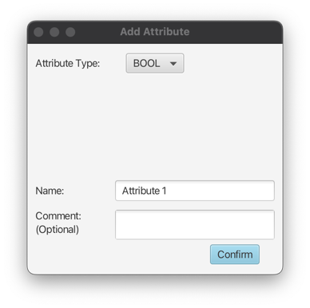
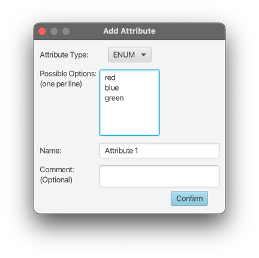
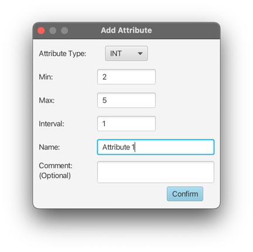

# Creating an Attribute

Entities and Relations can have attributes. When one of such Objects is selected, the bottom right panel will
show the Attributes section. Here, attributes can be created by using the `+` button.
This will open up a popup to specify the attribute. This window contains a choice box to select one of three available
attribute types.

## Attribute Types

There are three different attribute types that can be selected using the "Attribute Type" choice box:

### Boolean

This is the simplest type, as the possible values are already predefined by definition (`true`, `false`).

### Enumeration

For an enum attribute, the possible options can be entered manually to a text field.
Each line will be considered as one possible string value.

### Integer (Number Range)

The integer type can be configured by providing a minimum, maximum and interval value

