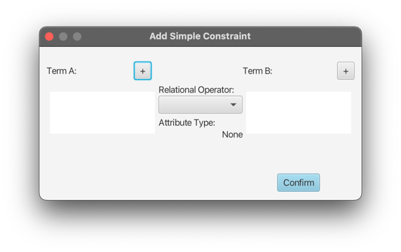

# Constraints

Custom constraints can be added to restrict values of Attributes of Entities of a System.
Currently, constraints can be created in a tree structure.
When adding a new constraint, the main window looks like the following:

Here, a new constraint can be started by using the `New Root` button.
This will open the `Add simple Constraint` popup:

