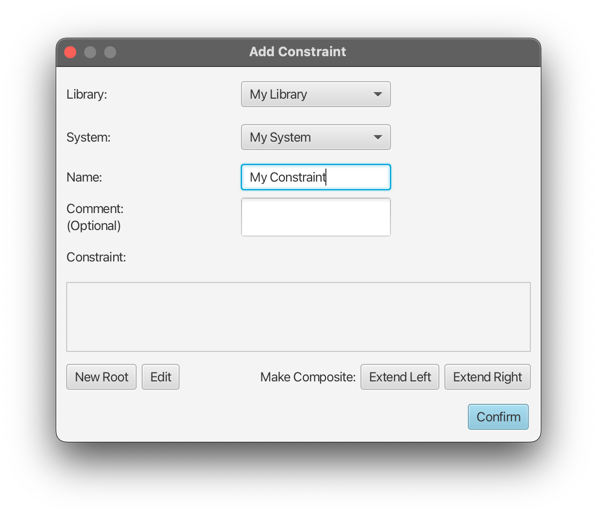
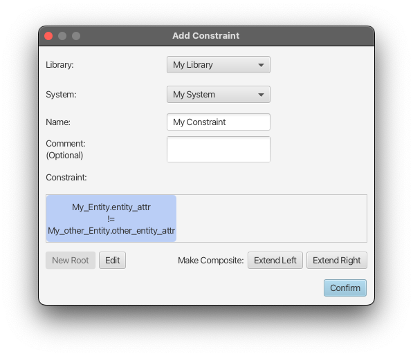
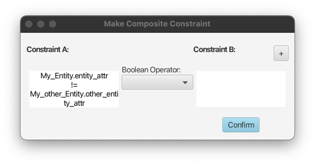
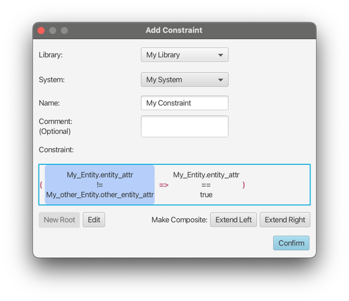
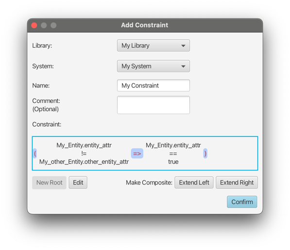
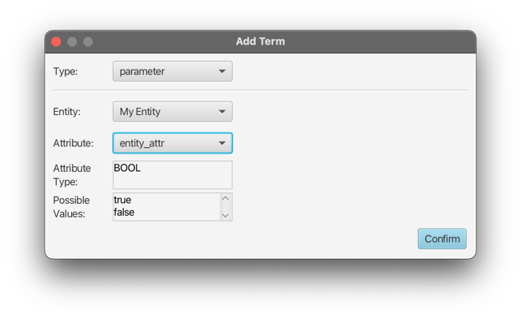
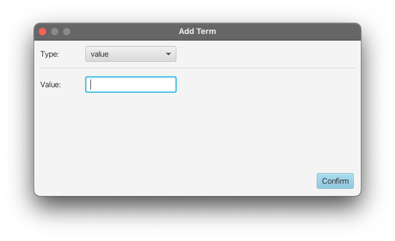
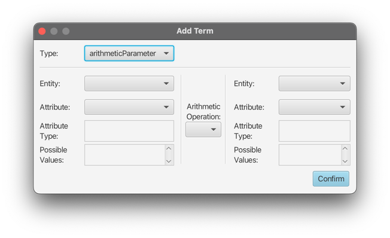
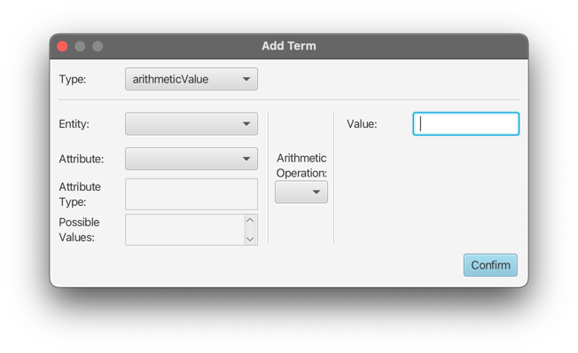

# Creating a Constraint

Custom constraints can be added to restrict values of Attributes of Entities of a System.
Currently, constraints can be started from a single simple constraint, and expanded in a binary-tree structure.

When creating a new constraint, the main window looks like the following:

Here, a new constraint can be started by using the `New Root` button bottom left.

## Simple Constraint Creation

This will open the `Add simple Constraint` popup:

A simple constraint consists of two terms and a relational operator. Attributes used in both terms need to be of the
same attribute type (boolean, enumeration, integer), and the available relational operators depend on the used type.
Attributes can be added using the two `+` buttons, and the operator can be selected using the choice box.

For more information on terms see [**Term Types**](#term-types) below.

## Expanding Simple Constraints

After the root has been created, it will be visible in the constraint area of the root window:

From this point on, the constraint can be arbitrarily expanded (made composite) by selecting it (by highlighting it via mouseclick),
and using the `Expand Left` and `Expand Right` buttons. This buttons will open up the `Make Composite constraint` popup,
with the existing constraint being on the left or right side, depending on the used button. The following screenshot
shows the example after using `Expand Right`:

Here, a boolean operator (`&&`, `||`, or `=>`) can be selected to combine the existing constraint with a second new one.
The new constraint can be created using the `+`, button, which will open up the `Add simple Constraint` popup.

After the constraint has been expanded, it can be seen in the root `Add Constraint` window. Here, the composite constraint
is wrapped in parentheses. For easier overview on complex constraints, the parentheses and operator of a single
composite constraint are colored the same, and every additional composite constraint will use a different,
randomly selected color.

Additionally, composite constraints can be selected and expanded the same way as simple constraints,
by selecting the parentheses or operator.
Already expanded single constraints can also be further expanded, allowing creation of arbitrarily complex constraints.

## Term Types

There are four different types of terms:

### Parameter

A parameter term is a single attribute of any entity in the system. The system is predefined by the selection in the
initial `Add Constraint` popup.

!!! note

    If the term in creation is the second term of the simple constraint, the available attributes might be limited.
    This is because attributes of both terms must have the same type, and the available attributes will be
    filtered by the type of the already existing term.

### Value

The value term is the simplest type, as it only consists of a custom value that can be entered to the text field.

!!! warning

    The text field allows unrestricted use of characters and numerals.
    This type should only be used in accordance with the other term used in the same constraint, to avoid
    yielding undesired and unexpected results.

### Arithmetic Parameter

This type is a combination of two attributes, that are connected by an arithmetic operation.

!!! note

    As this type uses arithmetic parameters, it can only be used for attributes of type integer (number range).

### Arithmetic Value

The arithmetic value type combines an attribute and a custom value, using an arithmetic operation.

!!! note

    As this type uses arithmetic parameters, it can only be used for attributes of type integer (number range).

    Similarly, the custom value text field should only be used with numerical values.

