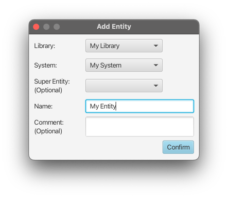

# Creating an Entity

Entities are part of a system, thus a parent system is required. As systems are part of libraries,
the `System` choice box will contain all systems of the selected library.

As there also can be inheritance relationships between entities of the same system,
a super entity can be specified upon entity creation.
The choice box will contain all existing entities of the selected system.

