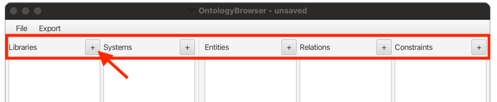

# Creation of Objects

Objects can be created using the `+` buttons in the respective column.  
In addition, all the five list views have an
`Add...` button in the context menu, that is equivalent to the `+`.

Depending on the type of object, a specific dialog window asking for properties will appear.

All types require a name, and allow for an optional comment.

Names must be unique in the context of the encapsulating objects.
Library-names must be unique globally, while system-names only need to differ inside the same library, etc.

