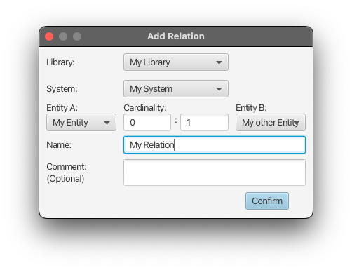

# Creating a Relation

Relations can be created between two entities of the same system.
The selection of a parent library will update the content of the `System` choice box,
and the selection thereof then again updates the content of the two entity choice boxes. 

The left and right cardinality fields represent the minimum and maximum arity, respectively:  
*"One Entity A can have at least 'min' and at most 'max' Entity B's"*

