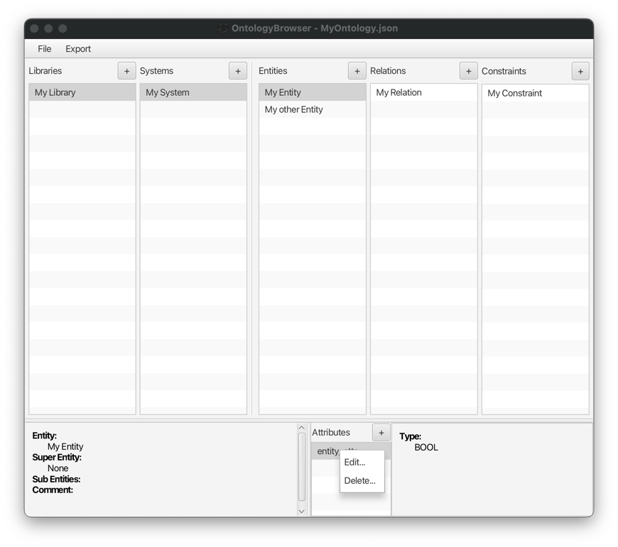
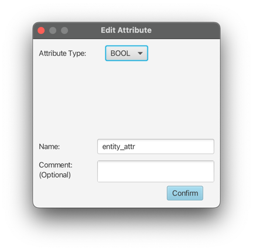

# Editing an Attribute

Attributes can be edited as all other object, by using `Edit...` in the context menu of the attribute list.

This will open up the `Edit Attribute` popup window. It is equivalent to `Add Attribute`, except that the existing
attribute will be modified instead of creating a new one.

