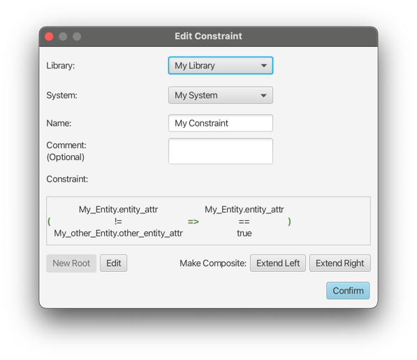
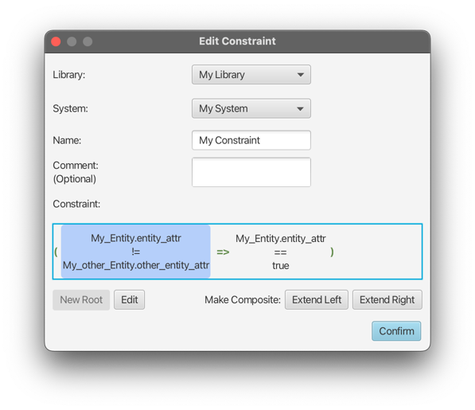
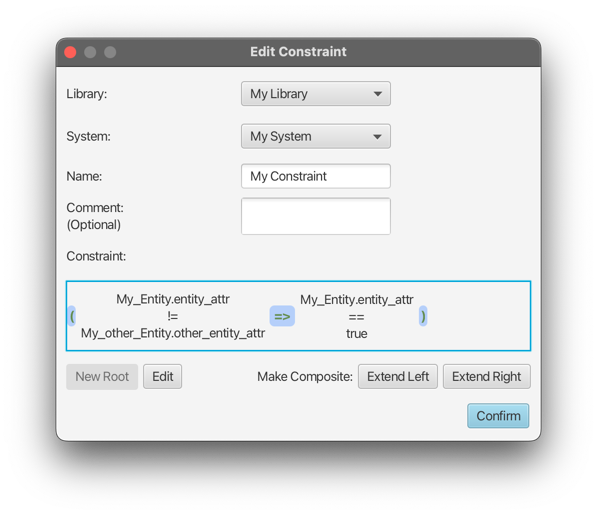
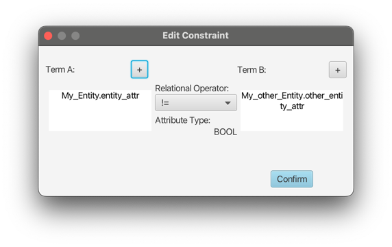
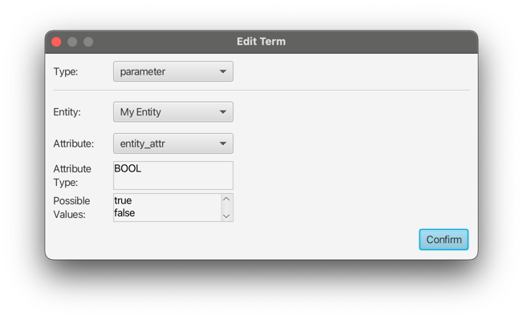
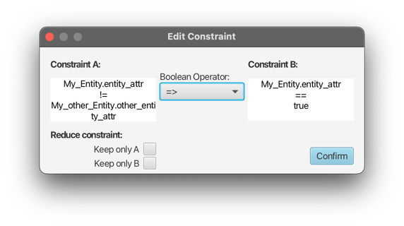

# Editing a Constraint

When modifying an existing constraint, the main window looks the same as when creating a new one,
with the existing constraint visible in the constraint view:

From here on, parts of the constraint can be edited by selecting them and pressing `Edit`.

## Editing a simple constraint

When using `Edit` with a simple constraint selected, the `Edit simple constraint` popup will open up for the selected
constraint.

In the popup directly, only the relational operator can be changed. The terms can either be overwritten with new ones by
using the `+` buttons, or edited by using `Edit` in the context menu that opens by right-clicking a term.
Using `Edit` on a term opens up another window, see [editing a term](#editing-a-term) below.

### Editing a term

When using `Edit` on a term, the `Edit term` window will open up. This allows full modification of the selected term,
similar to creating a new one during constraint creation.

## Editing a composite constraint

When using `Edit` while a composite constraint is selected, the `Edit composite constraint` window will open op.

This offers limited functionality, as it only allows changing the boolean operator and reducing the constraint by
ticking one of the two checkboxes. This will remove the boolean operator and one of the two inner constraints, 
depending on the selection.
For editing the inner constraints, select them directly in the root `Edit constraint` window.

