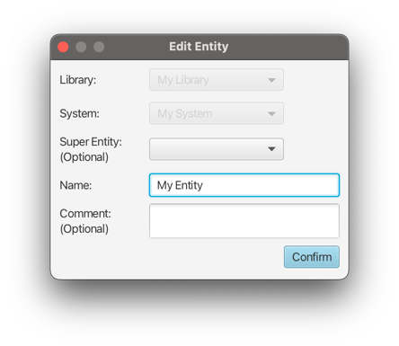

# Editing an Entity

Existing entities currently cannot be moved between systems, as this would break existing relations and constraints.
Thus, the system and library selection is locked.

However, the super entity and name can be changed:‚

.