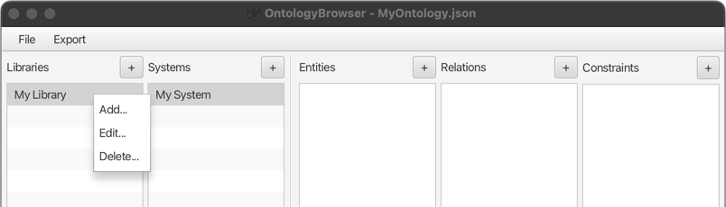

# Editing of Objects

All existing objects can be edited using `Edit...` the context menu, which can be accessed by right-clicking any existing
object in the browser.

Depending on the type of object to be edited, a different popup window will open up.

Note that objects currently cannot be moved between parent-objects
(e.g. systems between libraries, entities/relations/constraints between systems).

