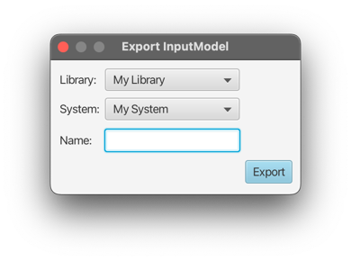
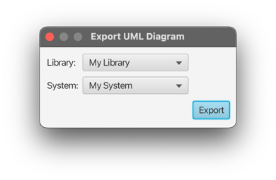
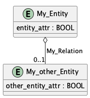

# Export menu

## Input Model

This option allows exporting a system as a text file containing an input model,
that can then be used as input for the combinatorial-testing-tool
[ACTS](https://csrc.nist.rip/groups/SNS/acts/documents/comparison-report.html#acts).

Pressing `Export` will open up a file selector that allows entering a filename or selecting an existing text file
for overwriting.

Afterwards, a popup shows whether the generation was successful, and the runtime of the algorithm.

## UML Diagram

This option allows the generation of a UML diagram from an existing system in the form of a png image.
It will contain the entities with all relation, but does not contain any constraints.

For example, the UML of a simple system could look like the following:

