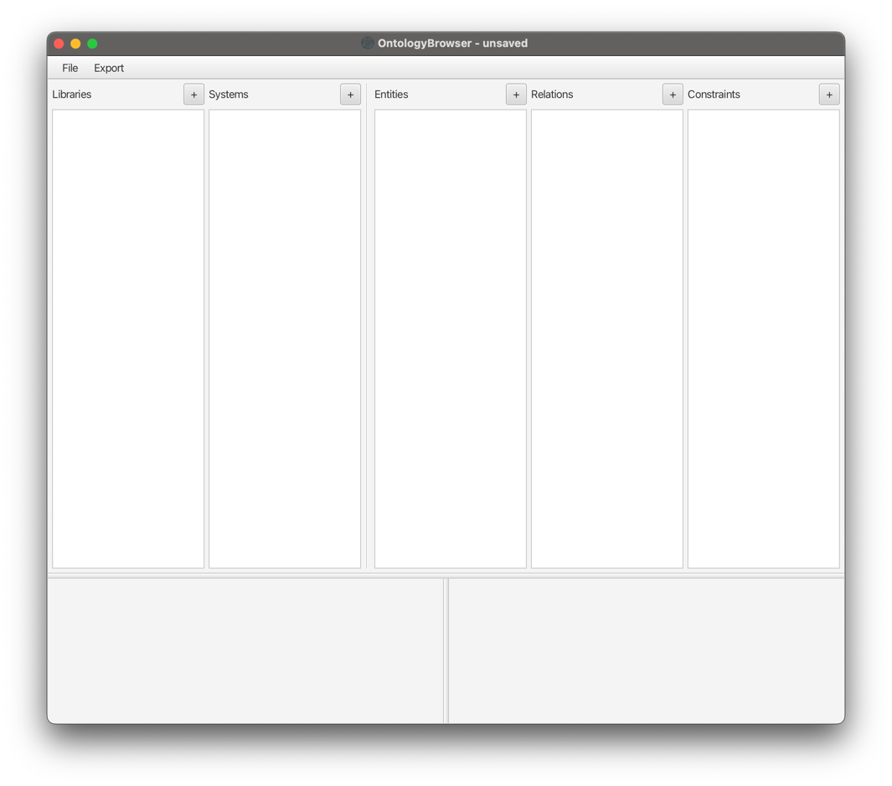

# Overview

The general interface of the browser looks like the following:

When an object is selected, all further views will show the respective contained objects.

When for example a Library is selected, the Systems list will show all existing Systems in this Library.
The same applies to a selected System, where contained Entities, Relations and Constraints are shown.

The bottom left area shows details about the selected Object.

When an Entity or Relation is selected, the bottom right area will show the Attributes of the respective Objects,
and allow generation and modification of Attributes.

## Ontology Structure

- Libraries
    - Systems
        - Entities
            - Attributes
        - Relations
            - Attributes
        - Constraints
